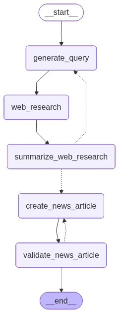

# News Generator

## Description

The News Generator is an AI-powered agent built with LangGraph that automates the process of creating news articles. It uses Large Language Models (LLMs) and MCP tools to perform in-depth web research on generated topics, and then it generates a news article based on the research. After generating the article, it also generates an audio version of the article using EllevenLabs API.

## Graph Visualization



This graph illustrates the workflow of the news generation process, including query generation, web research, summarization, reflection, finalization, and news article creation.

## Installation

1.  Clone the repository:
    ```bash
    git clone https://github.com/your-repo/news-generator.git
    cd news-generator
    ```

2.  Install dependencies:
    ```bash
    pip install -r requirements.txt
    ```

3.  Set up environment variables (e.g., API keys for MCP servers) in a `.env` file. See `example.env` for a template.

## Usage

Run the main script to generate a news article:

```bash
# Generate Web3 news (uses cache if fresh)
python news_generator/generate_news.py web3          # ✅ Works

# Generate AI Robotics news (uses cache if fresh)  
python news_generator/generate_news.py robotics      # ✅ Works

# Force fresh generation (clears cache first)
python news_generator/generate_news.py --force web3  # ✅ Works

# Show help
python news_generator/generate_news.py --help
```

The script will output the research results and save them to `final_research.json`. It will also generate an audio file of the news article in the `ellevenlabs_audio/generated_audio` directory.

## Features

-   **Automated News Generation**: The agent can generate a news article on a given topic, from research to writing, and even generate an audio version.
-   **LangGraph Integration**: The agent is built with LangGraph, which allows for a flexible and powerful workflow.
-   **MCP Tools**: The agent uses multiple MCP servers to perform in-depth web research.
-   **Iterative Summarization and Reflection**: The agent uses an iterative process of summarization and reflection to generate a comprehensive and accurate news article.
-   **Structured JSON Output**: The agent outputs a structured JSON object with the title, executive summary, key findings, and sources of the research.
-   **Audio Generation**: The agent generates an audio version of the news article using EllevenLabs API.

## Contributing

Contributions are welcome! Please open an issue or submit a pull request.
